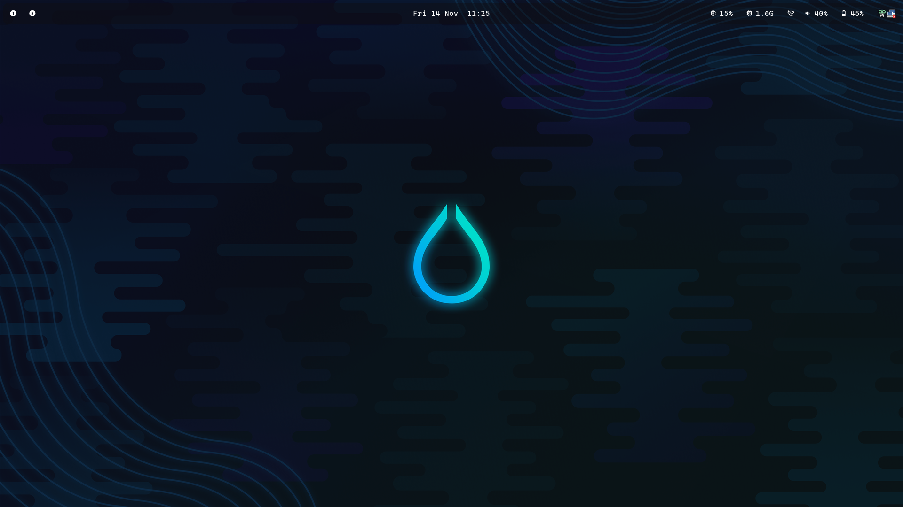

[this is my custom hyprland theme :) (i made the bar, theme inspired by nord theme, Nord theme repo here 
https://github.com/a-lebailly/nord-dotfiles/commits?author=a-lebailly)

all dependencies for this theme (Arch based system) - yay required

>
  <pre><code id="myCode">yay -S hyprland wayland wlroots xwayland hyprutils hyprcursor waybar lm_sensors gtk3 jq networkmanager network-manager-applet pipewire wireplumber pipewire-pulse pavucontrol ttf-cascadia-code ttf-nerd-fonts-symbols dunst libnotify hyprshot wl-clipboard kitty dolphin zenity
</code></pre>

all dependencies for debian based system first, run this command to add hyprland's repo (since hyprland repo isn't officially added)

>
  <pre><code id="myCode">curl -fsSL https://repo.hyprland.org/hyprland.gpg | sudo gpg --dearmor -o /usr/share/keyrings/hyprland.gpg

echo "deb [signed-by=/usr/share/keyrings/hyprland.gpg] https://repo.hyprland.org/apt/ ./" | sudo tee /etc/apt/sources.list.d/hyprland.list

sudo apt update
</code></pre>

then, install the dependencies, as required:

>
  <pre><code id="myCode">sudo apt install -y hyprland hyprutils hyprcursor waybar lm-sensors network-manager network-manager-gnome pipewire pipewire-audio wireplumber pavucontrol fonts-cascadia-code fonts-nerd-fonts dunst libnotify-bin wl-clipboard kitty dolphin grim slurp hyprshot jq zenity
</code></pre>

(of course there are some optional packages included, but you can always delete those later)

after that, run the install script

>
  <pre><code id="myCode">setup.sh
</code></pre>

you can install them seperately also, if you want

>
  <pre><code id="myCode">Nord_setup.sh
    Waybarsetup.sh
</code></pre>

you can check the keybinds in the hyprland.conf file, but i added theme here anyways

>
  <pre>$mainMod = SUPER # Sets "Windows" key as main modifier

# Example binds, see https://wiki.hyprland.org/Configuring/Binds/ for more
# open Chrome with Super + g
bind = $mainMod, Q, exec, $terminal
bind = ALT, F4, killactive, 
bind = $mainMod, X, killactive,
bind = $mainMod, M, exit,
bind = $mainMod, B, exec, /home/hyprusr/waybar.sh
bind = $mainMod, E, exec, $fileManager
bind = $mainMod, SPACE, togglefloating,
bind = $mainMod, R, exec, $menu
bind = $mainMod, D, exec, rofi -modi emoji -show emoji -kb-secondary-copy "" -kb-custom-1 Ctrl+c -theme ~/.config/rofi/config.rasi
bind = $mainMod, P, pseudo, # dwindle
bind = $mainMod, J, togglesplit, # dwindle
bind = $mainMod SHIFT, P, exec, hyprpicker
bind = $mainMod SHIFT, S, exec, hyprshot -m region
bind = , PRINT, exec, hyprshot -m output
bind = $mainMod, PRINT, exec, hyprshot -m window
# Move focus with mainMod + arrow keys
bind = $mainMod, left, movefocus, l
bind = $mainMod, right, movefocus, r
bind = $mainMod, up, movefocus, u
bind = $mainMod, down, movefocus, d
# Switch workspaces with mainMod + [0-9]
bind = $mainMod, F1, workspace, 1
bind = $mainMod, F2, workspace, 2
bind = $mainMod, F3, workspace, 3
bind = $mainMod, F4, workspace, 4
bind = $mainMod, F5, workspace, 5
bind = $mainMod, F6, workspace, 6
bind = $mainMod, F7, workspace, 7
bind = $mainMod, F8, workspace, 8
bind = $mainMod, F9, workspace, 9
bind = $mainMod, F10, workspace, 10
# Move active window to a workspace with mainMod + SHIFT + [0-9]
bind = $mainMod, 1, movetoworkspace, 1
bind = $mainMod, 2, movetoworkspace, 2
bind = $mainMod, 3, movetoworkspace, 3
bind = $mainMod, 4, movetoworkspace, 4
bind = $mainMod, 5, movetoworkspace, 5
bind = $mainMod, 6, movetoworkspace, 6
bind = $mainMod, 7, movetoworkspace, 7
bind = $mainMod, 8, movetoworkspace, 8
bind = $mainMod, 9, movetoworkspace, 9
bind = $mainMod, 0, movetoworkspace, 10

# Example special workspace (scratchpad)
bind = $mainMod, S, togglespecialworkspace, magic

  # Scroll through existing workspaces with mainMod + scroll
bind = $mainMod, mouse_down, workspace, e+1
bind = $mainMod, mouse_up, workspace, e-1

# Move/resize windows with mainMod + LMB/RMB and dragging
bindm = $mainMod, mouse:272, movewindow
bindm = $mainMod, mouse:273, resizewindow

# Laptop multimedia keys for volume and LCD brightness
bindel = ,XF86AudioRaiseVolume, exec, wpctl set-volume @DEFAULT_AUDIO_SINK@ 5%+
bindel = ,XF86AudioLowerVolume, exec, wpctl set-volume @DEFAULT_AUDIO_SINK@ 5%-
bindel = ,XF86AudioMute, exec, wpctl set-mute @DEFAULT_AUDIO_SINK@ toggle
bindel = ,XF86AudioMicMute, exec, wpctl set-mute @DEFAULT_AUDIO_SOURCE@ toggle
bindel = ,XF86MonBrightnessUp, exec, brightnessctl s 10%+
bindel = ,XF86MonBrightnessDown, exec, brightnessctl s 10%-

# Requires playerctl
bindl = , XF86AudioNext, exec, playerctl next
bindl = , XF86AudioPause, exec, playerctl play-pause
bindl = , XF86AudioPlay, exec, playerctl play-pause
bindl = , XF86AudioPrev, exec, playerctl previous
</pre>

thank you for clicking this repo on the first place, and thanks the crator of nord theme!
