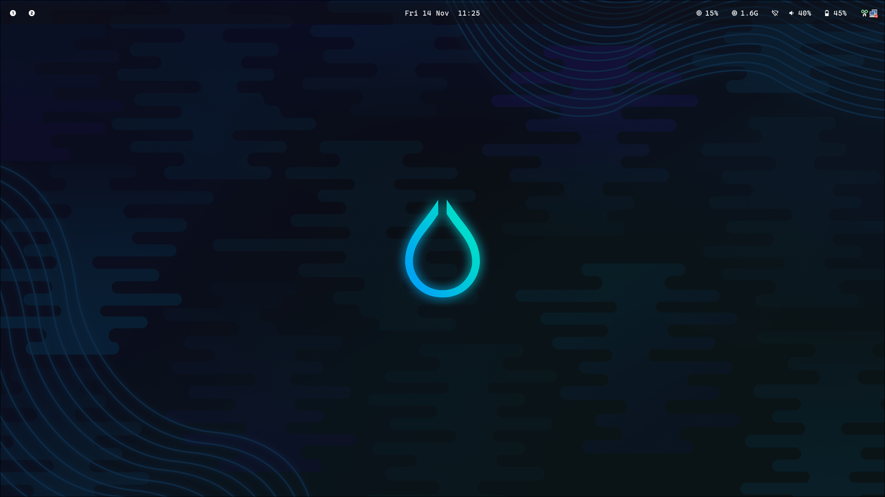

this is my custom hyprland theme :) (i made the bar, theme inspired by nord theme, Nord theme repo here 
https://github.com/a-lebailly/nord-dotfiles/commits?author=a-lebailly)

all dependencies for this theme (Arch based system) - yay required

>
  <pre><code id="myCode">yay -S hyprland wayland wlroots xwayland hyprutils hyprcursor waybar lm_sensors gtk3 jq networkmanager network-manager-applet pipewire wireplumber pipewire-pulse pavucontrol ttf-cascadia-code ttf-nerd-fonts-symbols dunst libnotify hyprshot wl-clipboard kitty dolphin
</code></pre>

all dependencies for debian based system first, run this command to add hyprland's repo (since hyprland repo isn't officially added)

>
  <pre><code id="myCode">curl -fsSL https://repo.hyprland.org/hyprland.gpg | sudo gpg --dearmor -o /usr/share/keyrings/hyprland.gpg

echo "deb [signed-by=/usr/share/keyrings/hyprland.gpg] https://repo.hyprland.org/apt/ ./" | sudo tee /etc/apt/sources.list.d/hyprland.list

sudo apt update
</code></pre>

then, install the dependencies, as required:

>
  <pre><code id="myCode">sudo apt install -y hyprland hyprutils hyprcursor waybar lm-sensors network-manager network-manager-gnome pipewire pipewire-audio wireplumber pavucontrol fonts-cascadia-code fonts-nerd-fonts dunst libnotify-bin wl-clipboard kitty dolphin grim slurp hyprshot jq
</code></pre>

(of course there are some optional packages included, but you can always delete those later)

clone the repo using git

>
  <pre><code id="myCode">git clone https://github.com/sudoslashcoder/Hyprtheme/
</code></pre>

run this after cloning the repo

>
  <pre><code id="myCode">~/Hyprtheme/Tstosetbarandminimaldesign.sh
</code></pre>

Here are the keybinds, its pretty self explainatory
>
  <pre>
bind = $mainMod, Q, exec, $terminal
bind = $mainMod, X, killactive,
bind = $mainMod, M, exit,
bind = $mainMod, B, exec, /home/hyprusr/waybar.sh
bind = $mainMod, E, exec, $fileManager
bind = $mainMod SHIFT, SPACE, togglefloating,
bind = $mainMod, R, exec, $menu
bind = $mainMod, P, pseudo, # dwindle
bind = $mainMod, J, togglesplit, # dwindle
bind = $mainMod SHIFT, P, exec, hyprpicker
bind = $mainMod SHIFT, S, exec, hyprshot -m region
bind = , PRINT, exec, hyprshot -m output
bind = $mainMod, PRINT, exec, hyprshot -m window
bind = $mainMod, left, movefocus, l
bind = $mainMod, right, movefocus, r
bind = $mainMod, up, movefocus, u
bind = $mainMod, down, movefocus, d
</pre>

($mainMod is basically the Windows or Command key on Macbooks)

This theme is made by sudoslashcoder, included Nord
Thank you for clicking on this repo, and even more for using this theme :D
